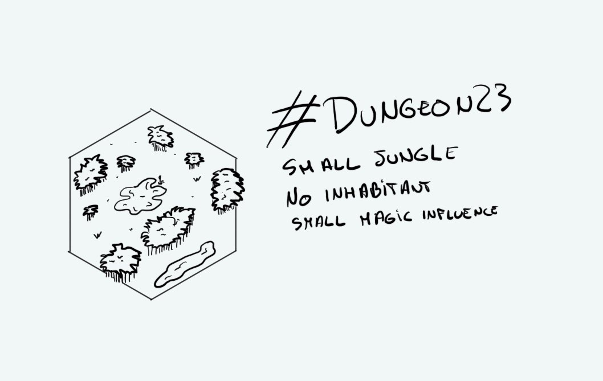

+++
title = "Day 1 - 2023-01-01 - Jungle"
date = 2023-01-01
[taxonomies]
categories=["January", "Wild lands", "Weak magic"]
tags=["Jungle", "Wild lands", "Weak magic"]
+++

## Linked hexes

- [Day 2 - 2023-01-02 - Inhabited Mesa](../day-2)
- [Day 6 - 2023-01-06 - River & Lake](../day-6)
- [Day 7 - 2023-01-07 - Swamps](../day-7)
- [Day 8 - 2023-01-08 - Ralakoï](../day-8)
- [Day 10 - 2023-01-10 - Temple](../day-10)

## What's going on here?
> A small refreshing part of the forest. Humidity seems tolerables but it seems to be the nest of insects and other rodents. A fairytale says an hag is coming sometimes to prepare her vile potions.

