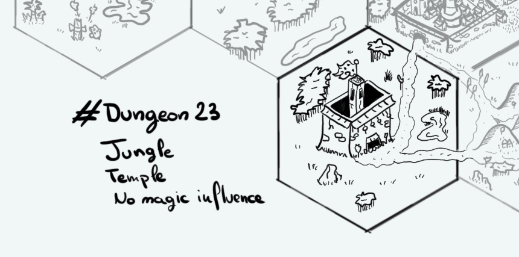

+++
title = "Day 10 - 2023-01-10 - Temple"
date = 2023-01-10
[taxonomies]
categories=["January", "Ralakoï", "Temple", "Jungle", "No magic"]
tags=["Ralakoï", "Temple", "Jungle", "No magic"]
+++

## Linked hexes
- [Day 1 - 2023-01-01 - Jungle](../day-1)
- [Day 8 - 2023-01-08 - Ralakoï](../day-8)
- [Day 9 - 2023-01-09 - Hills](../day-9)
- [Day 11 - 2023-01-11 - River & City](../day-9)

## What's going on here?
> The **High Temple of the 7 Celestials** is the most famous religious institution in Ralakoï. It's almost mandatory for nobles from the capital to go there and pray under the *Roof of the World tapestry*. The temple is the main place where the oracles learn and write for their Books. It also contains the region highest observatory.

