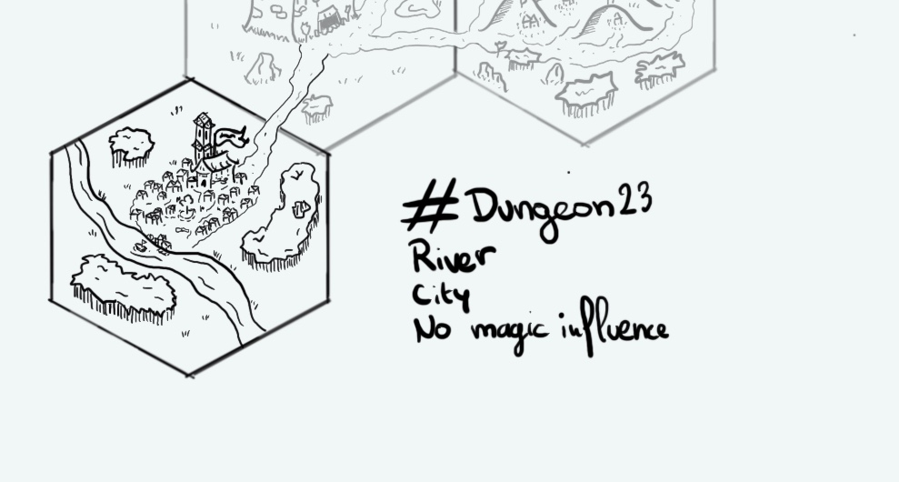

+++
title = "Day 11 - 2023-01-11 - River & City"
date = 2023-01-11
[taxonomies]
categories=["January", "Ralakoï", "Temple", "Jungle", "No magic"]
tags=["Ralakoï", "Temple", "Jungle", "No magic"]
+++

## Linked hexes
- [Day 10 - 2023-01-10 - Temple](../day-10)
- [Day 12 - 2023-01-12 - Plains](../day-12)

## What's going on here?
> **Ogoshi** has not always been the big city it is now and even less one under the banner of Ralakoï. It was first a fishermen villages then an indenpendent town. It only fell under the siege of the previous king 50 years ago. Ogoshi is mostly composed by humans and dwarves. Before the huge assassination waves ordered by Mahalee, the city was controlled by her nephew. It's now one of the queen puppet who rules and answers only to her. Ralakoï nobles like to naviguate close to Ogoshi as a mere distraction. However everyone knows that the river is bad tempered and can be dangerous especially upstream in the wild lands.

