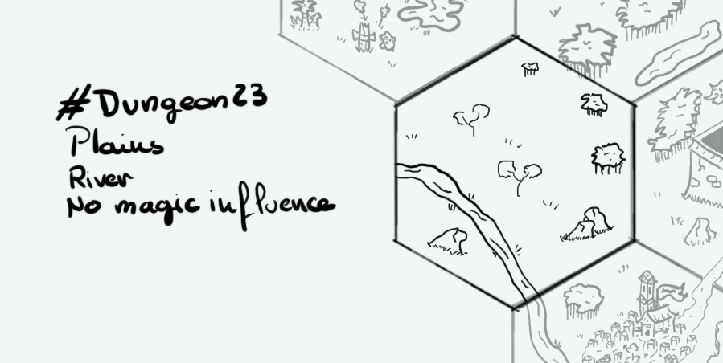

+++
title = "Day 12 - 2023-01-12 - Plains"
date = 2023-01-12
[taxonomies]
categories=["January", "Wild lands", "Plains", "River", "No magic"]
tags=["Wild lands", "Wild lands", "River", "No magic"]
+++

## Linked hexes
- [Day 1 - 2023-01-01 - Jungle](../day-1)
- [Day 7 - 2023-01-07 - Swamps](../day-7)
- [Day 11 - 2023-01-11 - River & City](../day-9)

## What's going on here?
> A plains where the wild lands start. Hunters from the nearest city love to go there. However travellers need to be careful about predators lurking for preys.

