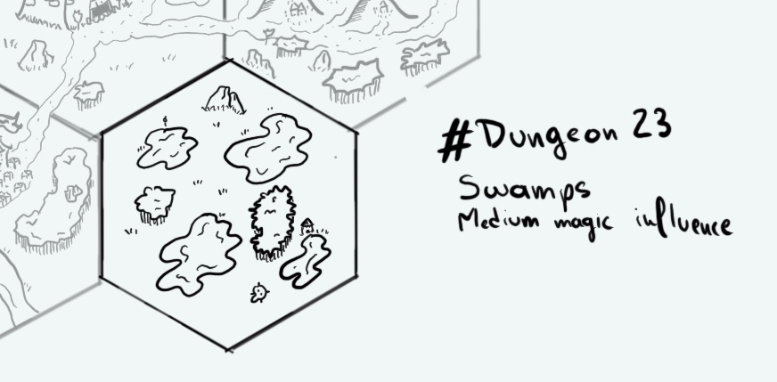

+++
title = "Day 13 - 2023-01-13 - Swamps"
date = 2023-01-13
[taxonomies]
categories=["January", "Wild lands", "Swmaps", "Medium magic"]
tags=["Wild lands", "Swmaps", "Medium magic"]
+++

## Linked hexes
- [Day 9 - 2023-01-09 - Hills](../day-9)
- [Day 10 - 2023-01-10 - Temple](../day-10)
- [Day 11 - 2023-01-11 - River & City](../day-11)

## What's going on here?
> Those swamps are considered haunted by Ralakoï citizens. Legends tell it's a hag territorry, she's lurking to catch reckless travellers.

