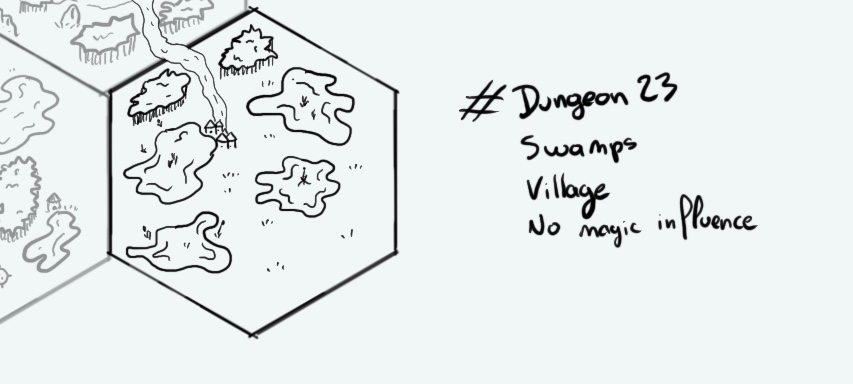

+++
title = "Day 14 - 2023-01-14 - Swamps"
date = 2023-01-14
[taxonomies]
categories=["January", "Ralakoï", "Swmaps", "No magic"]
tags=["Ralakoï", "Swmaps", "No magic"]
+++

## Linked hexes
- [Day 9 - 2023-01-09 - Hills](../day-9)
- [Day 13 - 2023-01-13 - Swamps](../day-13)

## What's going on here?
> A small village in the swamps close to Ralakoï. Locals don't like people from the city so much however they are always very welcoming with travellers.

