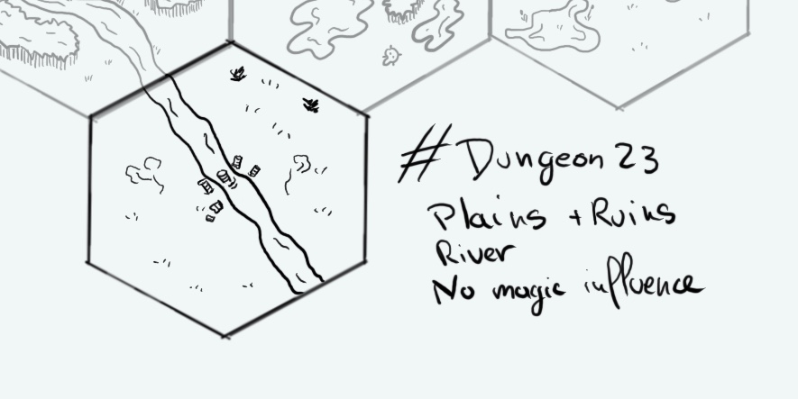

+++
title = "Day 15 - 2023-01-15 - Plains & Ruins"
date = 2023-01-15
[taxonomies]
categories=["January", "Wild lands", "Plains", "River", "Ruins", "No magic"]
tags=["Wild lands", "Plains", "River", "Ruins", "No magic"]
+++

## Linked hexes
- [Day 11 - 2023-01-11 - River & City](../day-11)
- [Day 13 - 2023-01-13 - Swamps](../day-13)

## What's going on here?
> A plain crossed by the Ogoshi river. There are some ruins of an ancient bridge.

