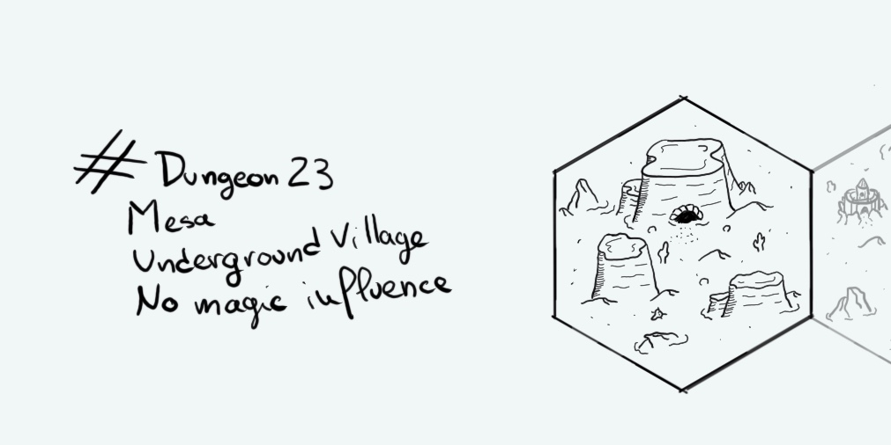

+++
title = "Day 16 - 2023-01-16 - Underground village"
date = 2023-01-16
[taxonomies]
categories=["January", "Red Burrow", "Mesa", "No magic"]
tags=["Red Burrow", "Mesa", "No magic"]
+++

## Linked hexes
- [Day 5 - 2023-01-05 - Desert](../day-5)

## What's going on here?
> **The Red Burrow Community** started to live underground almost 200 years ago. First it was a mining camp with the only goal to sell all the iron they found under the mesa. Sadly they planned to trade with the city of **R'Gonteh** and the **Ralakoï** country but both were way too powerful and the community too small to be of any of interest for them. From here the dwarves and the trolls from below began to plan their revenge and learn to forge axes, swords and pikes.

