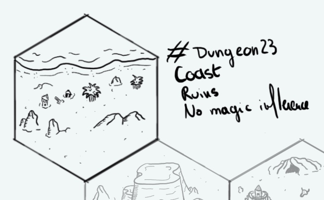

+++
title = "Day 17 - 2023-01-17 - Coast"
date = 2023-01-17
[taxonomies]
categories=["January", "Coast", "Ruins", "Nomads", "No magic"]
tags=["Coast", "Ruins", "Nomads", "No magic"]
+++

## Linked hexes
- [Day 16 - 2023-01-16 - Underground village](../day-16)
- [Day 18 - 2023-01-16 - Mesa village](../day-18)

## What's going on here?
> **Iridescent Sea** coast. A nomad tribe of fisher gnomes seem to operate here.

