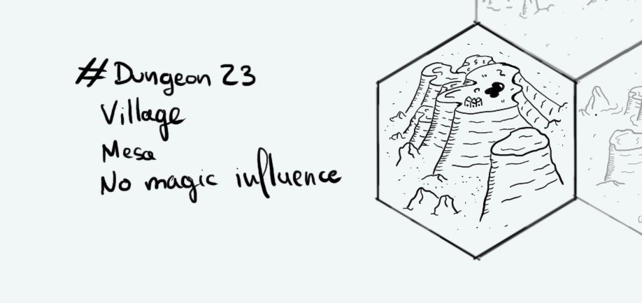

+++
title = "Day 18 - 2023-01-18 - Mesa village"
date = 2023-01-18
[taxonomies]
categories=["January", "Mesa", "Nomads", "No magic"]
tags=["Mesa", "Nomads", "No magic"]
+++

## Linked hexes
- [Day 17 - 2023-01-16 - Coast](../day-17)
- [Day 18 - 2023-01-16 - Mesa village](../day-18)

## What's going on here?
> A high mesa where live a small village of sheperd orcs

