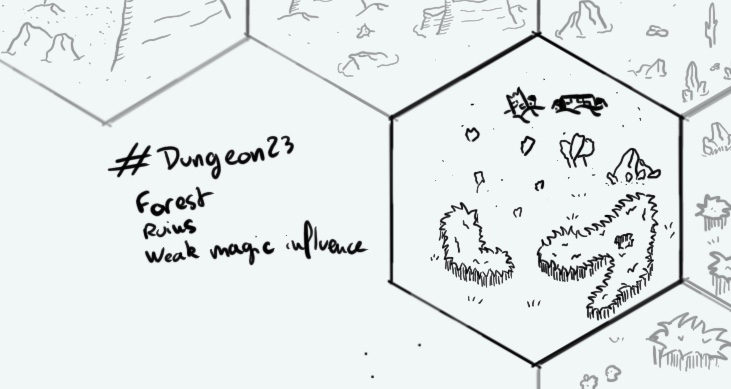

+++
title = "Day 19 - 2023-01-19 - Forest"
date = 2023-01-19
[taxonomies]
categories=["January", "Forest", "Ruins", "Wild lands", "Weak magic"]
tags=["Mesa", "Forest", "Ruins", "Wild lands", "Weak magic"]
+++

## Linked hexes

- [Day 03 - 2023-01-03 - Inub, town in ruins](../day-3)
- [Day 05 - 2023-01-05 - Desert](../day-5)
- [Day 06 - 2023-01-06 - River & Lake](../day-6)
- [Day 16 - 2023-01-16 - Underground village](../day-16)
- [Day 20 - 2023-01-20 - R'Gonteh](../day-20)
- [Day 21 - 2023-01-21 - Desert](../day-21)

## What's going on here?
> Ruins stuck between a small forest and the desert. Weird wilds animals wait for their next preys...

