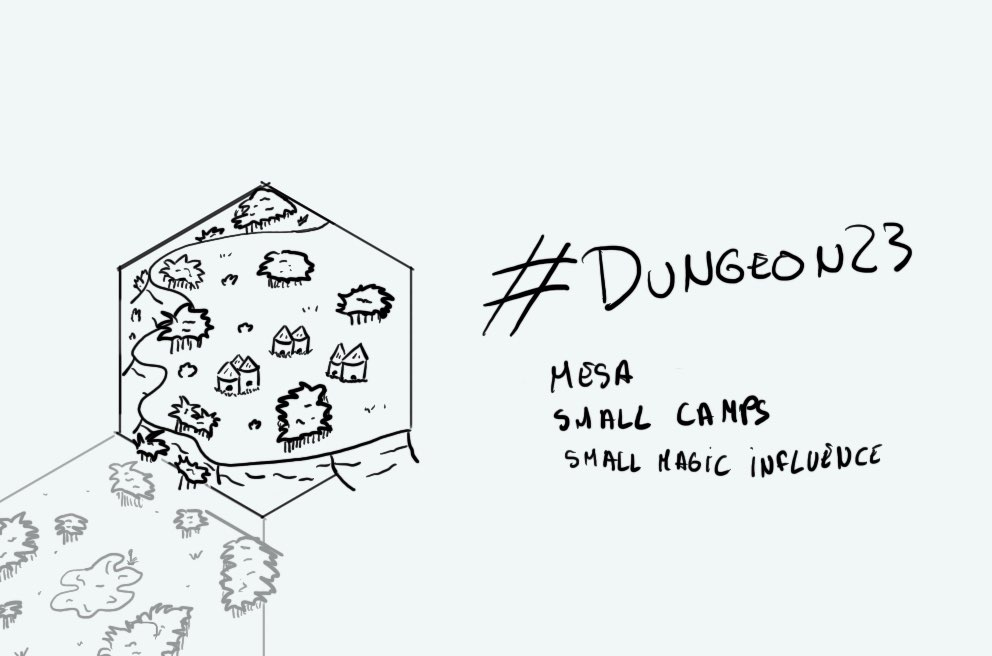

+++
title = "Day 2"
date = 2023-01-02
[taxonomies]
categories=["January", "Wild lands", "Camps", "Weak magic"]
tags=["Mesa", "Wild lands", "Camps", "Weak magic"]
+++

# Day 2 - 2023-01-02 - Inhabited Mesa

> The camp overlooking the forest from the small mesa was no more than a dozen of wooden houses. It was one of this unaligned clan. **The Guhrnogots** were survivors with no chief. They were only following their faith in some wind spirits only heard by them. Most of the families were dwarfs and orcs. There were also trolls and even a minotaur! The youngest were joking about him being more dead than alive...

Linked hexes: 
- [day1](https://d23.jobo.to/day-1)
- [day3](https://d23.jobo.to/day-3)
