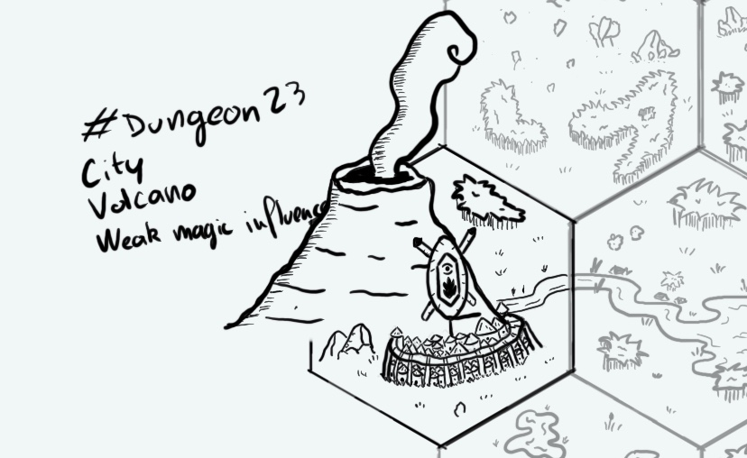

+++
title = "Day 20 - 2023-01-20 - R'Gonteh"
date = 2023-01-20
[taxonomies]
categories=["January", "Volcano", "City", "R'Gonteh", "Weak magic"]
tags=["Volcano", "City", "R'Gonteh", "Weak magic"]
+++

## Linked hexes

- [Day 06 - 2023-01-06 - River & Lake](../day-6)
- [Day 07 - 2023-01-07 - Swamps](../day-7)
- [Day 19 - 2023-01-19 - Forest](../day-19)
- [Day 21 - 2023-01-21 - Desert](../day-21)

## What's going on here?
> The Old Town of **R'Gonteh**, made of strong wood and solid rocks. Its story goes back 2000 years in the past when the ancestors of the current inhabitants, the **Ugons**, travelled to find the Sacred Flame.
> Inhabitants believe the volcano they live on is their main "Old Spirit". The **Brew Keeper** is the main governor of the city. It has to be a chaman studiying the geothermy for all this life. Many try every ten year to become the new one.
> To do so, contestants need to succeed to bring some obsidian rock still warm (or at least they can make believe it is). 
> R'Gonteh is one of the main nation in the region, it has a strong trade relationship with **Ralakoï**. Most of its citizen are trolls or orcs. 

