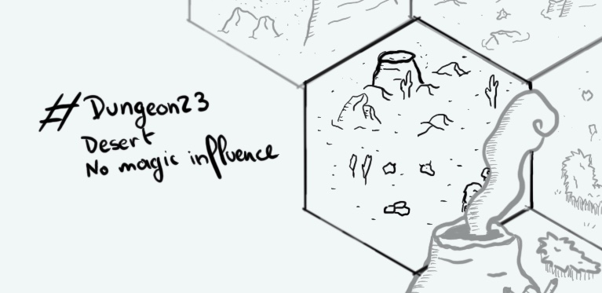

+++
title = "Day 21 - 2023-01-21 - Desert"
date = 2023-01-21
[taxonomies]
categories=["January", "Desert", "Wild lands", "No magic"]
tags=["Desert", "Wild lands", "No magic"]
+++

## Linked hexes

- [Day 16 - 2023-01-16 - Underground village](../day-16)
- [Day 18 - 2023-01-18 - Mesa Village](../day-18)
- [Day 19 - 2023-01-19 - Forest](../day-19)
- [Day 20 - 2023-01-20 - R'Gonteh](../day-20)

## What's going on here?
> A wild land desert.

