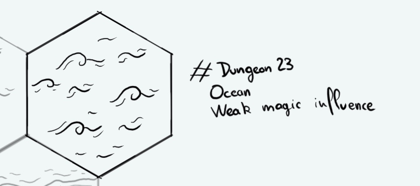

+++
title = "Day 23 - 2023-01-23 - Ocean"
date = 2023-01-23
[taxonomies]
categories=["January", "Ocean", "Wild lands", "Weak magic"]
tags=["Ocean", "Wild lands", "Weak magic"]
+++

## Linked hexes

- [Day 17 - 2023-01-17 - Coast](../day-17)
- [Day 22 - 2023-01-22 - Ocean](../day-22)

## What's going on here?
> The ocean. Some sailors say they saw weird creatures around here.

