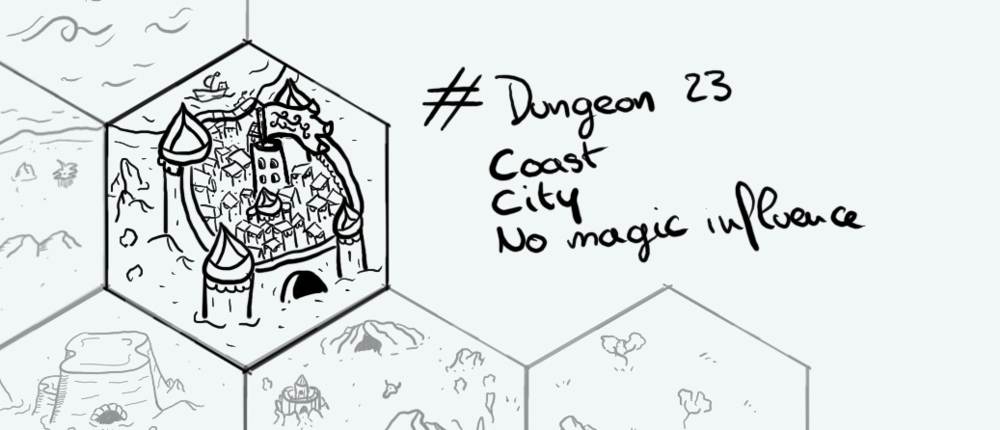

+++
title = "Day 24 - 2023-01-24 - Naav Sharan"
date = 2023-01-24
[taxonomies]
categories=["January", "Coast", "City", "Naav Sharan", "No magic"]
tags=["Coast", "City", "Naav Sharan", "No magic"]
+++

## Linked hexes

- [Day 5  - 2023-01-05 - Desert](../day-5)
- [Day 16 - 2023-01-16 - Red burrow mines](../day-16)
- [Day 17 - 2023-01-17 - Coast](../day-17)
- [Day 23 - 2023-01-23 - Ocean](../day-23)

## What's going on here?
> **Naav Sharan** is an old colony from a distant empire. It became independent long ago but its inhabitants keep a fierce distrust about strangers.
> The city is now governed by the **Coral Judges**, an assembly of the town most powerful shipowners. 
> Its main resource is coming from the sea. The pearl of Naav Sharan are famous everywhere and are traded for a good amount of gold.

