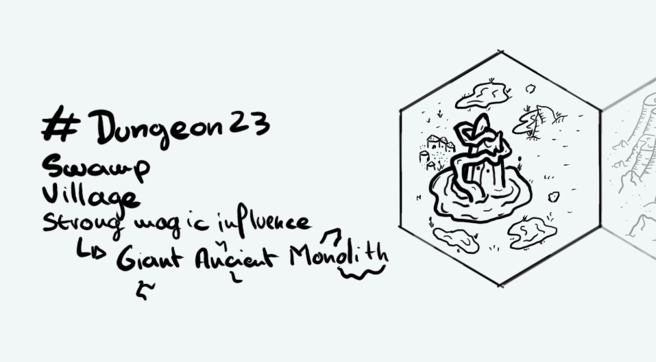

+++
title = "Day 25 - 2023-01-25 - Mysterious monolith"
date = 2023-01-24
[taxonomies]
categories=["January", "Swamp", "Village", "Naav Sharan", "Strong magic"]
tags=["Swamp", "Village", "Naav Sharan", "Strong magic"]
+++

## Linked hexes

- [Day 18 - 2023-01-18 - Mesa Village](../day-18)

## What's going on here?
> The small of **Seema** is at the westernmost of **Naav Sharan** lands. It's located at the edge of mysterious swamps. A scary gigantic monolith covered by runes and moss drives away most of the travellers.
> Rumors say villagers sacrifice them to the rock...

