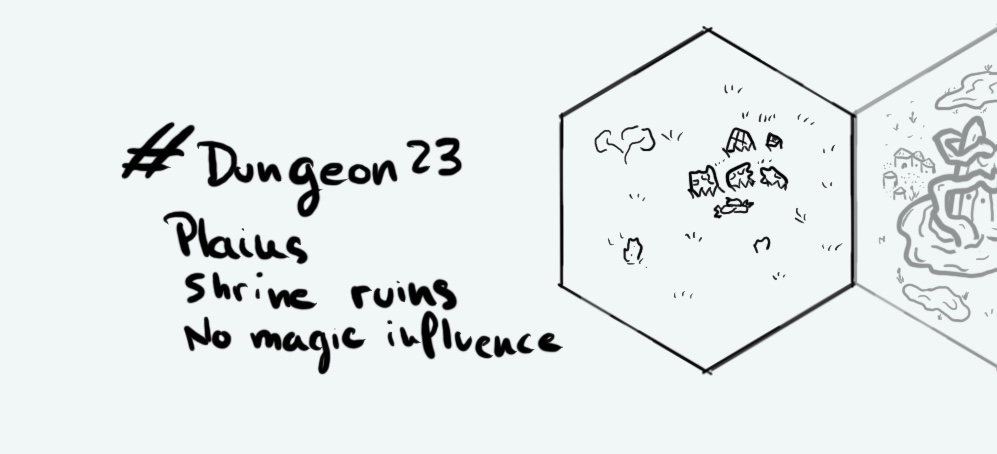

+++
title = "Day 26 - 2023-01-26 - Plains & Ruins"
date = 2023-01-26
[taxonomies]
categories=["January", "Wild lands", "Plains", "Ruins", "No magic"]
tags=["Wild lands", "Plains", "Ruins", "No magic"]
+++

## Linked hexes
- [Day 25 - 2023-01-25 - Mysterious monolith](../day-25)

## What's going on here?
> Shrine ruins in an empty plain.

