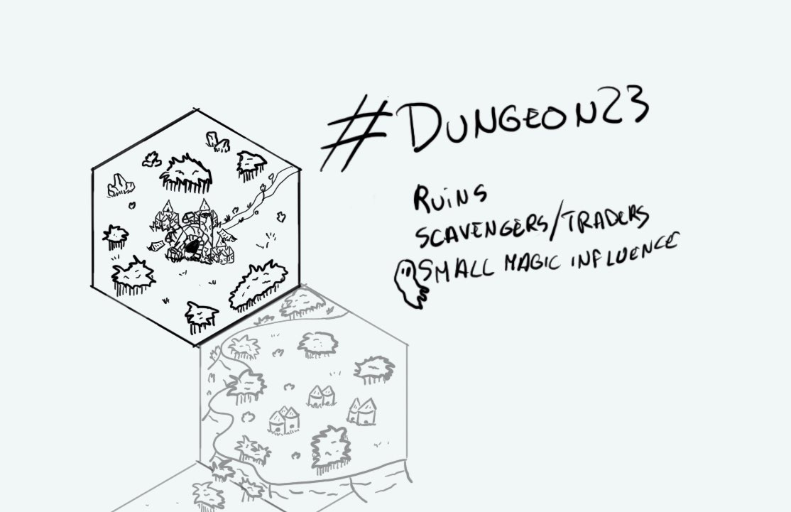

+++
title = "Day 3"
date = 2023-01-03
[taxonomies]
categories=["January", "Wild lands", "Nomads", "Ruins", "Town", "Weak magic"]
tags=["Mesa", "Wild lands", "Nomads", "Ruins", "Town",  "Weak magic"]
+++

# Day 3 - 2023-01-03 - Inub, town in ruins

> The **Debulen** family was always considered as scavengers or thieves. Their last stop was the old town of **Inub**. They found the ruins so peaceful and full of ancient treasures they chose to stay. Travellers were rarely happy to trade with the gnomes. The most probable reason was this rumor about the ghost of an old wizard haunting the streets at night. Or the fact that all the Debulens "wonders" seemed broken and useless... 

Linked hexes: 
- [day2](https://d23.jobo.to/day-2)
