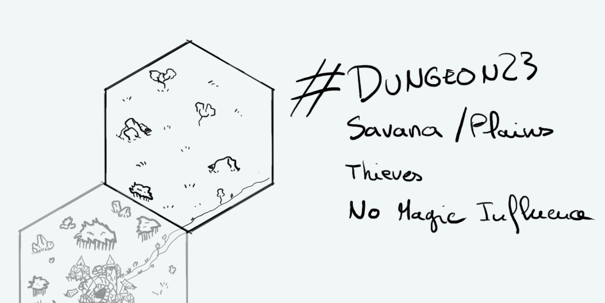

+++
title = "Day 4 - 2023-01-04 - Savana/plains"
date = 2023-01-04
[taxonomies]
categories=["January", "Wild lands", "Nomads", "Savana", "No magic"]
tags=["Mesa", "Wild lands", "Nomads",  "No magic"]
+++

## Linked hexes

- [Day 3 - 2023-01-03 - Inub, town in ruins](https://d23.jobo.to/day-3)
- [Day 5 - 2023-01-05 - Desert](https://d23.jobo.to/day-5)

## What's going on here?
> The **Ankbulens** were gnomes and they were thieves. If their cousins from [Inub](https://d23.jobo.to/day-3) are harmless scavengers they are their perfect counterpart. Violent and aggressive, they trap and kill travellers for less than a dime.

