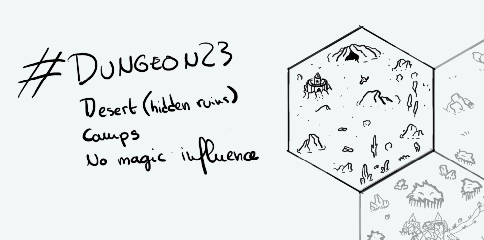

+++
title = "Day 5 - 2023-01-05 - Desert"
date = 2023-01-05
[taxonomies]
categories=["January", "Wild lands", "Camps", "Desert", "No magic"]
tags=["Desert", "Wild lands", "Camps",  "No magic"]
+++

## Linked hexes
- [Day 3 - 2023-01-03 - Inub, town in ruins](https://d23.jobo.to/day-3)
- [Day 4 - 2023-01-04 - Savana / plains](https://d23.jobo.to/day-4)

## What's going on here?
> The **Oblique University** never stopped to lavish its knowledge even after the **Great Capharnaüm**. Its buried ruins under a thousand year old desert are treseaure from the ancient past. **The Society of the Illustrous Scholars from R'gonteh** understood quite rapidly. After decades the minor guild successfully extracted tablets and books lost more than two thousand years ago, proving wrong all its detractors. The expedition quickly transformed itself in a more sedantary camp above the main extraction site. It even has its own tiny library containing probably the region oldest written texts. Population is mostly composed by orcs and humans protecting the small council of goblin scholars. Sometimes some of the warriors try to integrate the closed circle of scientists. For now only one succeed, **Demenos The Bold**, a half-orc. He's now the director of Ancient Anatomy Studies.

