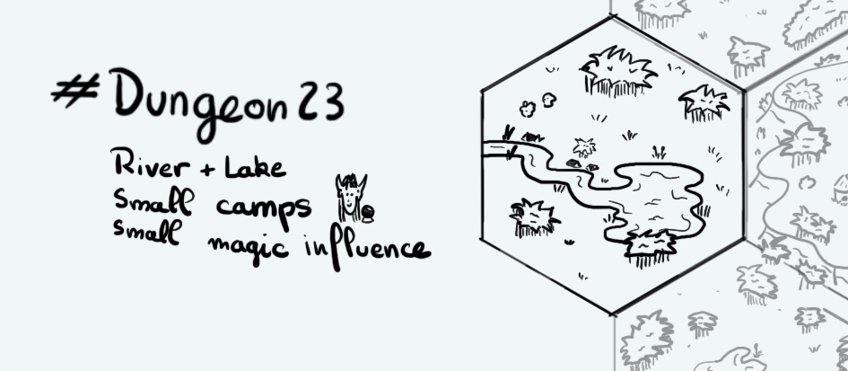

+++
title = "Day 6 - 2023-01-06 - River & Lake"
date = 2023-01-06
[taxonomies]
categories=["January", "Wild lands", "Nomads", "River", "Lake", "Weak magic"]
tags=["River", "Lake", "Wild lands", "Nomads", "Weak magic"]
+++

## Linked hexes
- [Day 1 - 2023-01-01 - Jungle](../day-1)
- [Day 2 - 2023-01-02 - Inhabited Mesa](../day-2)
- [Day 3 - 2023-01-03 - Inub, town in ruins](../day-3)
- [Day 7 - 2023-01-07 - Swamps](../day-3)

## What's going on here?
> The **Tamanushi lake** is a religious site for some animists praying a fish god hiding under the water. The cultists seems to follow the river as a pilgrimage. Most of them appear to be humans, elves or gnomes from different villages.

