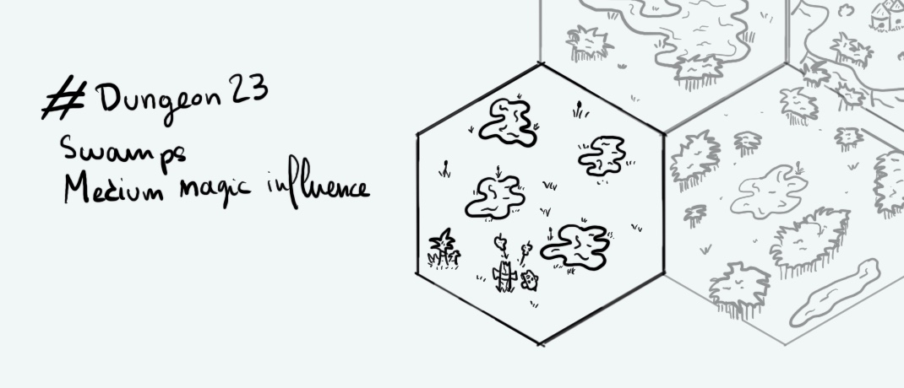

+++
title = "Day 7 - 2023-01-07 - Swamps"
date = 2023-01-07
[taxonomies]
categories=["January", "Wild lands", "Swamps", "Medium magic"]
tags=["Swamps", "Wild lands", "Medium magic"]
+++

## Linked hexes
- [Day 1 - 2023-01-01 - Jungle](../day-1)
- [Day 6 - 2023-01-06 - River & Lake](../day-6)

## What's going on here?
> Those swamps haven't been inhabited for centuries. However some legends say evil creatures lurk to eat adventurous travellers...
>

