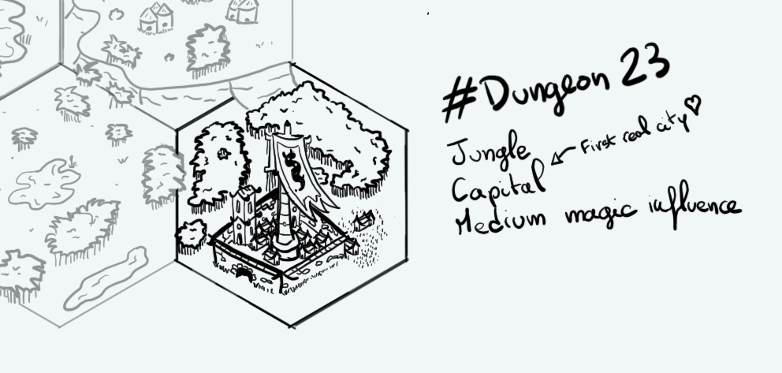

+++
title = "Day 8 - 2023-01-08 - Ralakoï"
date = 2023-01-08
[taxonomies]
categories=["January", "City", "Jungle", "Lake", "Medium magic"]
tags=["Ralakoï", "City", "Jungle", "Medium magic"]
+++

## Linked hexes
- [Day 1 - 2023-01-01 - Jungle](../day-1)
- [Day 2 - 2023-01-02 - Inhabited Mesa](../day-2)
- [Day 9 - 2023-01-09 - Hills](../day-9)
- [Day 10 - 2023-01-10 - Temple](../day-10)

## What's going on here?
> **Ralakoï, City of Thousand Libraries** , is lost in the middle of the jungle and seems to be coming directly from a fairytale. Its outside streets interwined with the edge of the wild lands majestic forest.
> Every part of the city seems to match perfectly the outside world. Buildings are all wood and fabrics. 
> However is mostly famous for its abundant sources of knowledge.
>
> First, there is the Horned Snake Queen **Momoji university palace**. In this maze we can find the biggest amount of texts in this part of the known world. Poetry, philosophical essays and mathematic treaties are common and well guarded by their own army, **The Spirit Shields**
>
> The actual orc queen, **Mahalee**, wears the crown of the **Horned Snake**, symbol of the greatest wisdom. She comes from the **G'hugnak** dynasty which has been in place for 150 years. Young, clever and with a beauty know by all, she is becoming a source of conflict in its own country. Indeed, after killing all of its possible political opponents, she decided to refuse to bear a new heir for the kingdom, creating an unclear future...
> Oracles from the **Tower of the Sky-Weaver** are trying to mitigate the incident and keeping peace at least in the city. These priests are also scientists. They are the main information givers to the population, especially through their own **Book of 7th Celestials**. This anthology is mixing scientific knowledge and religious precepts. Every temple of the city has part of this monumental work.
>
> The last place where one can find knowledge materials is the most forbidden one. It contains the oldest and darkest volumes. The **Apostrophics of the Forgotten**, are cataccombs where prohibited texts are all together with tombs. Those sanctuaries run through everywhere under Ralakoï and are guarded by the **Silent**, the queer very own guard. The rumor says that some of the books there are older than the city itself and came directly from the **Age of Wonder**...
>
> Ralakoï population is mostly composed by orcs, elves and gnomes. Those tend to have a bad reputation due to the fact most the bandit clans in the wild lands are gnomes. 
>
> Most of the commercial trades of the city are made with its ally and rival **R'Gonteh** in the north. Caravans make the journey between both never without a well equiped escort...

